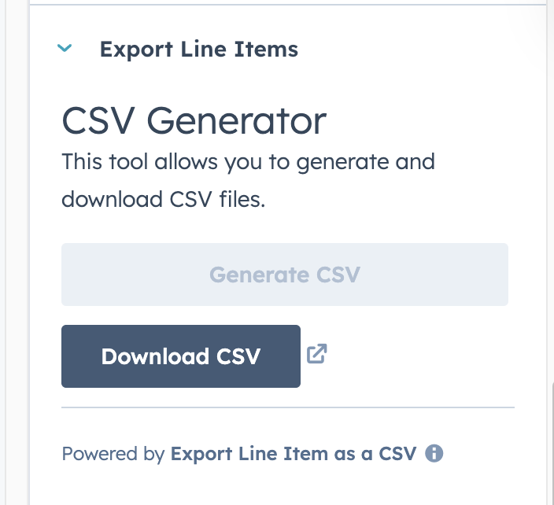

# HubSpot Line‑Item Export as CSV

Easily download **Deal line‑items** from HubSpot as a CSV file—right from the record sidebar.

---

## ✨ Features
- One‑click export of all line‑items associated with a Deal
- CSV is generated in‑portal and downloaded instantly
- Built with HubSpot UI Extensions (React + HubSpot CLI)


---

## 🚀 Quick Start

### 1. Clone the repository
```bash
git clone git@github.com:chethanakh/hubspot-line-item-export-as-csv.git
cd hubspot-line-item-export-as-csv
```

### 2. Install the HubSpot CLI  
```bash
npm install -g @hubspot/cli
```

### 3. Initialize HubSpot CLI in the project directory  
```bash
hs init
```
Follow the prompt to **create a personal access key** or paste an existing one.

### 4. Authenticate with your HubSpot portal  
```bash
hs auth
```
Select—or paste the ID of—the portal where you want the extension installed.

### 5. Upload the project to HubSpot  
```bash
cd line-item-export 
hs project upload
```
This command creates (or updates) the **UI‑extension project** in your portal.

> **Note**  
> First‑time upload also **installs** the extension, so it becomes available to add to record sidebars.

---

## 🛠️ Add the card to a record sidebar

1. In HubSpot, open **Settings → Objects → Deals → Record Customization → Customize the right sidebar**.  
2. Click **“Add card”** → **“Apps”** → choose **“Line‑Item Export as CSV”**.  
3. Use the drag handle to position the card, then click **Save** (top right).  
4. Navigate to any **Deal record** → the new card appears. Click **Export CSV** to download.

---

## 🐞 Troubleshooting

| Problem | Fix |
|---------|------|
| **`hs: command not found`** | Ensure `npm install -g @hubspot/cli` completed and your shell PATH includes global `npm` bins. |
| **Upload fails with “project.json not found”** | Verify you are in the folder that contains `project.json` before running `hs project upload`. |
| **Card not visible in sidebar** | Confirm it is added in **Customize the right sidebar** and you clicked **Save**. |

---

## 📚 Helpful Resources

| Topic | Docs link |
|-------|-----------|
| HubSpot CLI – install & configure | <https://developers.hubspot.com/docs/cli> |
| Personal Access Keys (authentication) | <https://developers.hubspot.com/docs/api/private-apps> |
| Building UI Extensions | <https://developers.hubspot.com/docs/ui-extensions/overview> |
| `project.json` reference | <https://developers.hubspot.com/docs/ui-extensions/project-json-reference> |
| Deploying projects (`hs project upload`) | <https://developers.hubspot.com/docs/cli/project-commands#project-upload> |
| Customizing record sidebars | <https://knowledge.hubspot.com/crm-setup/customize-the-right-sidebar-of-records> |
